# dynQR - Open Source Dynamic QR Platform

<div align="center">


**Create QR codes that can be updated anytime without reprinting**

[](https://nextjs.org/)
[](https://www.typescriptlang.org/)
[](https://supabase.com/)
[](LICENSE)

</div>

---

## 🎯 What is Dynamic QR?

Unlike **static QR codes** that point directly to a URL, **dynamic QR codes** point to a redirect endpoint. This means you can change where the QR leads without printing a new code.

```
Traditional Static QR:
[QR Code] → https://example.com  ❌ Can't change

Dynamic QR (dynQR):
[QR Code] → https://app.com/qr/abc123 → https://example.com  ✅ Update anytime!
```

<div align="center">
  
  <br/>
  <em>One QR code, multiple destinations - change anytime without reprinting!</em>
</div>

### Perfect For:
- 🍽️ **Restaurants** - Update menus without reprinting table stickers
- 🎉 **Events** - Change event details after flyers are distributed
- 📦 **Products** - Update product pages without new packaging
- 🏪 **Retail** - Rotate promotional offers with the same QR

---

## 🏗️ How Prototype Works - Architecture

```mermaid
flowchart TB
    subgraph USER["👤 User Flow"]
        A[📱 Scan QR Code] --> B[🌐 GET /qr/abc123]
    end
    
    subgraph NEXTJS["⚡ Next.js App"]
        B --> C{Active?}
        C -->|Yes| D[✅ HTTP 302 Redirect]
        C -->|No| E[❌ Show Error Page]
    end
    
    subgraph SUPABASE["🗄️ Supabase"]
        C -.->|Query| F[(PostgreSQL)]
        F -.->|Response| C
        D -.->|Update scan_count| F
    end
    
    subgraph DASHBOARD["📊 Dashboard"]
        G[🔐 Auth User] --> H[Create/Edit QR]
        H --> F
        G --> I[View Analytics]
        F --> I
    end
    
    D --> J[🎯 Destination URL]
    
    style USER fill:#e1f5fe
    style NEXTJS fill:#fff3e0
    style SUPABASE fill:#e8f5e9
    style DASHBOARD fill:#f3e5f5
```



### Architecture Components

| Component | Technology | Purpose |
|-----------|------------|---------|
| **Frontend** | Next.js 14 + React | Server-side rendering, dynamic routes |
| **API Layer** | Next.js API Routes | CRUD operations, QR generation |
| **Database** | Supabase PostgreSQL | Store QR codes, analytics, user data |
| **Authentication** | Supabase Auth | User login, signup, session management |
| **QR Engine** | `qrcode` npm package | Generate QR code images on-demand |

### Request Flow

```
1. 📱 User scans QR → Points to: https://app.com/qr/abc123
                          ↓
2. ⚡ Next.js Route → /qr/[shortId]/page.tsx handles request
                          ↓
3. 🗄️ Database Query → SELECT * FROM qr_codes WHERE short_id = 'abc123'
                          ↓
4. 🔀 Decision Point → Is code active AND exists?
         ↓                              ↓
       ✅ YES                         ❌ NO
         ↓                              ↓
5a. 📊 Update Stats           5b. 🚫 Show Error
    (scan_count++)                 (404 or inactive)
         ↓
6. 🎯 HTTP 302 Redirect → User lands on current_url
```

### Security Layers

- **Row Level Security (RLS)** - Users can only access their own QR codes
- **Authenticated Routes** - Dashboard requires login via Supabase Auth
- **Public Redirect** - `/qr/[shortId]` is public for scanning without login
- **Service Role Key** - Used only in secure API routes for privileged operations

---

## ✨ Features

- ✅ **Unlimited QR Codes** - Create as many as you need, forever free
- ✅ **Instant URL Updates** - Change destinations in seconds
- ✅ **Scan Analytics** - Track scan counts and last scan times
- ✅ **Active/Inactive Toggle** - Deactivate QR codes without deleting
- ✅ **High-Quality Downloads** - PNG exports with error correction
- ✅ **Mobile Responsive** - Works on all devices
- ✅ **100% Open Source** - MIT licensed, fork and modify freely

---

## 🛠️ Tech Stack

| Category | Technology |
|----------|------------|
| Frontend | Next.js 14 (App Router) |
| Language | TypeScript (Strict Mode) |
| Styling | Tailwind CSS |
| UI Components | shadcn/ui + Radix UI |
| Backend | Next.js API Routes |
| Database | Supabase (PostgreSQL) |
| Authentication | Supabase Auth |
| QR Generation | qrcode npm package |*/

---

## 🚀 Getting Started

### Prerequisites

- Node.js 18+ 
- npm or yarn
- A [Supabase](https://supabase.com) account (free tier works!)

### 1. Clone the Repository

```bash
git clone https://github.com/AditthyaSS/DynQR.git
cd DynQR
```

### 2. Install Dependencies

```bash
npm install
```

### 3. Set Up Supabase

1. Create a new project at [supabase.com](https://supabase.com)
2. Go to **SQL Editor** and run the contents of `schema.sql`
3. Go to **Settings → API** and copy your credentials

### 4. Configure Environment Variables

```bash
cp .env.local.example .env.local
```

Edit `.env.local` with your Supabase credentials:

```env
NEXT_PUBLIC_SUPABASE_URL=https://your-project.supabase.co
NEXT_PUBLIC_SUPABASE_ANON_KEY=your-anon-key
SUPABASE_SERVICE_ROLE_KEY=your-service-role-key
```

### 5. Run the Development Server

```bash
npm run dev
```

Open [http://localhost:3000](http://localhost:3000) in your browser.

---

## 📁 Project Structure

```
dynqr/
├── src/
│   ├── app/
│   │   ├── (auth)/           # Auth pages (login, signup, etc.)
│   │   ├── api/              # API routes
│   │   │   ├── codes/        # QR CRUD endpoints
│   │   │   └── generate-qr/  # QR image generation
│   │   ├── dashboard/        # Protected dashboard pages
│   │   ├── qr/[shortId]/     # Public redirect handler
│   │   └── page.tsx          # Landing page
│   ├── components/ui/        # shadcn/ui components
│   └── lib/
│       ├── supabase/         # Supabase clients
│       ├── types/            # TypeScript types
│       └── utils/            # Utility functions
├── schema.sql                # Database schema
└── .env.local.example        # Environment template
```

---

## 🔐 How the Redirect Works

1. User scans QR code pointing to `https://your-app.com/qr/abc123`
2. `/qr/[shortId]/page.tsx` receives the request
3. Server queries database for `short_id = abc123`
4. If active, increments scan count and redirects (HTTP 302) to `current_url`
5. If inactive or not found, shows appropriate error page

This redirect is **public** - no authentication required for scanning.

---

## 🌐 Deployment

### Google IDX

This project includes `.idx/dev.nix` for easy deployment to Google IDX:

1. Import the project to Google IDX
2. Add environment variables in IDX settings
3. The preview URL will be your QR base URL

### Vercel

```bash
npm i -g vercel
vercel
```

Add your environment variables in the Vercel dashboard.

### Other Platforms

Works with any platform that supports Next.js 14:
- Netlify
- Railway
- Render
- Self-hosted with `npm run build && npm start`

---

## 📊 Database Schema

The `qr_codes` table stores all QR code data:

| Column | Type | Description |
|--------|------|-------------|
| `id` | UUID | Primary key |
| `user_id` | UUID | Owner (references auth.users) |
| `short_id` | VARCHAR(8) | Unique redirect identifier |
| `name` | VARCHAR(255) | Display name |
| `current_url` | TEXT | Destination URL |
| `description` | TEXT | Optional description |
| `scan_count` | INTEGER | Total number of scans |
| `is_active` | BOOLEAN | Whether redirects work |
| `created_at` | TIMESTAMP | Creation time |
| `updated_at` | TIMESTAMP | Last update time |
| `last_scanned_at` | TIMESTAMP | Most recent scan |

Row Level Security (RLS) ensures users can only access their own QR codes.

---

## 🤝 Contributing

**Contributions are welcomed!** 🎉

Whether it's bug fixes, new features, documentation improvements, or ideas - we'd love your help!

1. Fork the repository
2. Create your feature branch (`git checkout -b feature/amazing-feature`)
3. Commit your changes (`git commit -m 'Add some amazing feature'`)
4. Push to the branch (`git push origin feature/amazing-feature`)
5. Open a Pull Request

### Ideas for Contributions:
- 🎨 Custom QR code colors/logos
- 📊 Advanced analytics dashboard
- 🔗 Bulk QR code creation
- 📱 PWA support
- 🌍 Internationalization (i18n)

---

## 📄 License

This project is licensed under the MIT License - see the [LICENSE](LICENSE) file for details.

---

## 🙏 Acknowledgments

- [Next.js](https://nextjs.org/) - The React Framework
- [Supabase](https://supabase.com/) - Open source Firebase alternative
- [shadcn/ui](https://ui.shadcn.com/) - Beautiful UI components
- [Lucide](https://lucide.dev/) - Beautiful icons

---

<div align="center">

**Made with ❤️ for the open source community**

[⭐ Star this repo](https://github.com/AditthyaSS/DynQR) if you find it useful!

</div>
